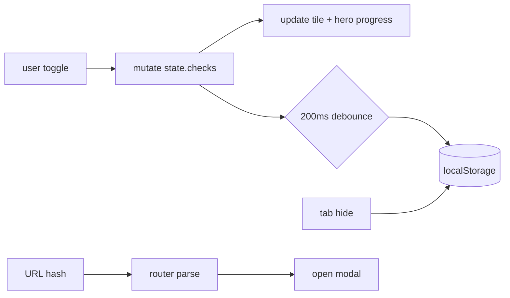

# prd-cheatsheet

The pre-code work decides the project. Ten gates before code.

## What this is

A handbook that remembers where you are. Ten phases between a rough PRD and a scaffold-ready repo, rendered as an interactive tracker that persists in your browser. Vanilla HTML, CSS, and JavaScript. No build step, no framework, no account. One browser holds one project's progress until you reset.

## How it works

The page is the project's memory until it has a repo.

Content lives in `data/phases.js` and renders into the DOM on load. Each tile in the bento grid is a phase; clicking one opens a modal with that phase's full checklist. Toggles write to `localStorage` through a 200ms debounce, with a forced flush on `visibilitychange` and `pagehide` so the last toggle before a tab close survives. Deep links like `/#phase-07` open a phase modal directly on page load and can be bookmarked.



## Architecture

One data file. Everything else renders it or routes to it.

```
prd-cheatsheet/
├── index.html           semantic shell + noscript notice
├── data/
│   └── phases.js        single content module: 10 phases + 2 reference lists
├── scripts/
│   ├── app.js           boot wiring, modal lifecycle, focus trap, reset flow
│   ├── render.js        DOM builders for tiles, packet, modal
│   ├── storage.js       localStorage with debounced flush + in-memory fallback
│   ├── router.js        hash parser, push-vs-deep-link close logic
│   ├── progress.js      pure progress math (phase, section, hero totals)
│   └── reveal.js        IntersectionObserver wrappers
├── styles/
│   ├── tokens.css       palette, type scale, motion, radii
│   ├── base.css         reset + font-face
│   ├── layout.css       hero, bento, packet, footer
│   ├── tile.css         phase tile card
│   ├── modal.css        overlay, dialog, safe-area
│   └── sigils.css       per-sigil perpetual micro-animations
├── assets/
│   ├── sigils.svg       10 line-drawn sigils as a <symbol> sprite
│   └── fonts/           Outfit Variable + Geist Variable (both SIL OFL 1.1)
└── tests/               node:test unit coverage for pure logic
```

The runtime is a single `<script type="module">` loading `scripts/app.js`, which imports the rest. Pure-logic modules (`storage`, `router`, `progress`, plus the `phases` schema validator) are exercised by `node --test` with 51 unit tests. The DOM layer is verified manually via `TESTING.md`.

## The ten phases

Ten gates from rough PRD to scaffold-ready.

| #   | Phase                                  | Items         | Gate | Anti-gate |
| --- | -------------------------------------- | ------------- | ---- | --------- |
| 01  | Triage the Rough PRD                   | 9             | 3    |           |
| 02  | Clarify Scope and Remove Ambiguity     | 15            | 4    |           |
| 03  | Decide the Technical Shape             | 14 (1 choice) | 3    |           |
| 04  | Produce the Pre-Scaffold Artifact Pack | 14            | 3    |           |
| 05  | Retire Critical Unknowns               | 7             | 2    |           |
| 06  | Translate Design into Executable Work  | 8             | 3    |           |
| 07  | Run the Scaffold Readiness Review      | 10            |      | 5         |
| 08  | Initialize the Repo Scaffold           | 19            | 3    |           |
| 09  | Start V1 Implementation                | 6             |      |           |
| 10  | Close V1                               | 8             |      |           |

Gates are "ready to move on" signals. Phase 03's choice is a single-select (pick one delivery model). Phase 07's anti-gate is the "don't scaffold yet" list: items are tickable as reminders but excluded from phase progress on purpose.

Two reference lists live in the Packet section below the bento: the Minimal Artifact Set (13 items) and the Final Pre-Code Check (10). They are scanned while you work, not followed in sequence.

## Authoring content

Edit the data, reload the page.

All copy lives in `data/phases.js` as a single exported `CHEATSHEET` object. Each item carries a stable id so edits do not wipe progress:

- `p<phase>-i<n>` for a task in the main items list
- `p<phase>-g<n>` for a task in the gate list
- `p<phase>-a<n>` for a task in the anti-gate list (Phase 07 only)
- `p<phase>-c<n>` for a choice block
- `p<phase>-c<n>-o<n>` for an option inside a choice
- `x-art-<n>` and `x-pcc-<n>` for Packet section items

Once saved, an id is never reused. The validator in `tests/phases.test.js` enforces id format and uniqueness on every commit.

## Running locally

No build step. Serve the project root and open it.

```sh
python3 -m http.server 8080
# visit http://localhost:8080/
```

Opening `index.html` directly via `file://` will fail because browsers refuse to load ES modules off the filesystem. Any static server works: Python's built-in, `npx serve`, `caddy file-server`, the Vercel CLI.

## Tests

```sh
npm test    # node --test tests/*.test.js
```

51 unit tests across `phases`, `storage`, `router`, and `progress`. Zero third-party dependencies at runtime or in the test layer. The runner is Node 20+'s built-in `node:test`. `TESTING.md` holds the manual smoke checklist for the DOM layer.

## Deployment

A static site. One Vercel project.

The repo root is the deploy root; no build command is set. Pushes to `main` deploy to production; pull requests get preview URLs automatically. Cache headers live in `vercel.json`: immutable long-lived cache on `/assets/fonts/*`, medium cache on `/assets/*` and `/styles/*`, short revalidating cache on `/`.

## Known limits

One browser, one project, no sync.

Progress is scoped to the current browser's `localStorage`. There is no account, no export, no sync between devices. Starting a new project means pressing `RESET PROGRESS` in the footer, which wipes state and reloads. This is by design: the tool is meant to be used once per greenfield effort, not to accrue as a durable project database.

## Governance

Code is owned by Dinesh. Protocol Zero applies: no AI attribution anywhere in commits, comments, or prose. Conventional commits, squash-only merges, linear history on `main`.
